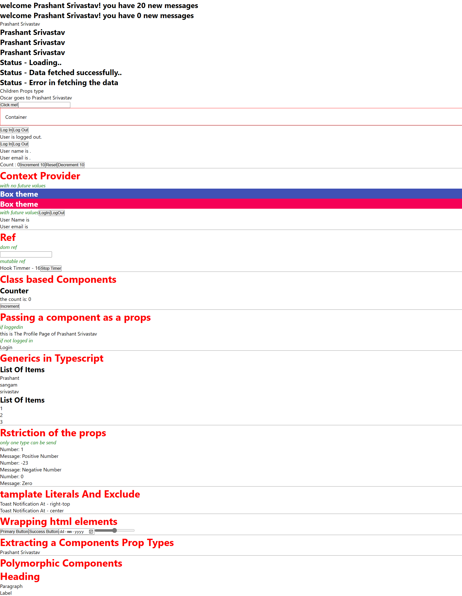

# TypeScript Learning Project with React.js

## Overview
This project documents my journey of learning TypeScript in conjunction with React.js development. It encompasses various concepts and techniques, highlighting the integration of TypeScript's static typing features with React components.

## Project Structure
The project structure reflects a gradual progression in TypeScript proficiency within the context of React.js development. Here's an outline of the project structure:

- **Components:** Contains React components written in TypeScript, showcasing type definitions for props and state.
- **Context:** Demonstrates the usage of TypeScript with React context API for managing global state.
- **Ref:** Illustrates how TypeScript enables type-safe interactions with DOM elements using refs.
- **State:** Implements state management in React components with TypeScript annotations.
- **Generics:** Explores the power of TypeScript generics in creating reusable and type-safe components.
- **Restriction:** Shows how TypeScript restricts prop types to ensure type safety and prevent errors.
- **Template Literals and Exclude:** Utilizes TypeScript template literals and exclude types for more precise type definitions.
- **HTML Element Wrapping:** Wraps HTML elements with custom components while maintaining type safety.
- **Polymorphic Components:** Implements polymorphic components with TypeScript to accept various HTML elements as props.

## Usage
To run the project locally and explore TypeScript with React.js:

1. Clone the repository to your local machine.
2. Navigate to the project directory.
3. Install dependencies using `npm install` or `yarn install`.
4. Start the development server using `npm start` or `yarn start`.
5. Open your browser and go to `http://localhost:3000` to view the application.

## Learning Objectives
Throughout this project, the primary learning objectives are as follows:
- Develop proficiency in TypeScript development within the React.js ecosystem.
- Understand and implement TypeScript's type annotations, interfaces, and generics in React components.
- Learn how TypeScript enhances code quality, readability, and maintainability in React projects.
- Explore advanced TypeScript features such as conditional types, mapped types, and utility types in React development.
- Gain insights into best practices for TypeScript usage in React projects and apply them effectively.

## Future Enhancements
Future enhancements for the TypeScript learning project may include:
- Incorporating more advanced TypeScript features and patterns to further enrich the learning experience.
- Exploring TypeScript libraries and tools specifically tailored for React development.
- Integrating TypeScript with state management libraries like Redux or MobX for more complex applications.
- Enhancing the project's documentation with detailed explanations and examples of TypeScript usage in React components.
- Collaborating with others to share knowledge and experiences in TypeScript-driven React development.

## Feedback and Contributions
Feedback and contributions are highly encouraged! Whether it's suggestions, improvements, or new ideas, your input can significantly enhance the project's value and utility. Feel free to open issues or pull requests to contribute to the project's growth and evolution.

Let's continue our TypeScript and React.js journey together, learning and growing as developers!

### Image Sample

